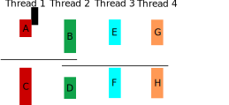

# 19 - Questões de revisão


## Parte 1

Com base no código em *parte1.c*, responda.

!!! exercise text short
    Quantos processos são criados pela execução do programa?

    !!! answer
        Contando com o processo original, serão criados quatro processos ao todo!

!!! exercise text medium
    Cada processo executa dois printf: `"f1 %d ...."` e `"fim %d\n"`. Encontre os pares de printf dada a saída abaixo. Ou seja, para cada print "Fim %d\n" encontre o print `"f1 %d ... "` correspondente.

    ```
    f1 7525 f2 7526 counter 6
    f1 7525 f2 0 counter 2
    fim 7526
    f1 0 f2 7527 counter 8
    f1 0 f2 0 counter 4
    fim 7527
    fim 7524
    fim 7525
    ```

!!! exercise text medium
     A saída abaixo é uma possível saída do programa acima? Explique por que. Você pode supor que o processo original tem pid `137`

    ```
    f1 138 f2 139  counter 6
    f1 138 f2 0 counter 2
    fim 137
    fim 139
    f1 0 f2 140 counter 8
    f1 0 f2 0 counter 4
    fim 140
    fim 138
    ```

    !!! warning
        Neste item você deverá explicar **por que** a saída é ou não possível e não apontar o que está diferente entre a saída mostrada e algum teste que você tenha feito.


## Parte 2

A figura *sincronizacao.svg* mostra uma situação com 4 threads em que existem dependências entre as partes de cada thread.



Faça as tarefas abaixo no programa *parte2.c*.

!!! example
    Lance as threads no main.

!!! example
    Use semáforos para criar as situações de sincronização na figura. 

!!! exercise text long
    Escreva abaixo os nomes dos semáforos utilizados, seu valor inicial e seu significado no programa.


## Parte 3

Ler um arquivo linha a linha é uma operação comum em programas e é feito de maneira bastante prática em Python usando a função `readlines`.

!!! example
    Crie uma função `char *proxima_linha(int fd)` que retorna uma string contendo a próxima linha do arquivo apontado por `fd`. Ao chegar no fim do arquivo a função passa a retornar `NULL`.

    !!! danger
        1. neste exercício você não pode usar a função `getline`.
        2. preencha sua função no arquivo *esqueleto.c*

    !!! done "Rubrica"
        - **50%** o exercício foi feito levando em conta um tamanho máximo de linha
        - **100%** linhas de tamanho arbitrário podem ser lidas.

!!! example
    Faça agora uma função `main` que usa sua função acima para ler todas as linhas de um arquivo passado como argumento de linha de comando e mostrar somente as que iniciam com uma letra maiúscula. Você não precisa fazer a rubrica "completa" para fazer este item.

## Parte 4

Para completar a revisão, desenvolva soluções para um simulado de prova!

[**Clique Aqui!**](simulado_sishard.zip) e faça o download do arquivo [`simulado_sishard.zip`](simulado_sishard.zip). Desenvolva a prova e aproveite para tirar qualquer dúvida com os professores!

!!! warning "Atenção"
    Perceba no simulado de prova que o `README.md` ou `README.html` contém todos os detalhes para resolução das questões, incluindo **critérios de avaliação**.
